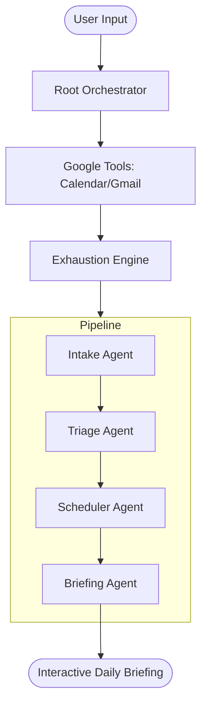

# 🛡️ BurnoutShield — The AI Chief of Staff
> **Proactive Burnout Prevention & Schedule Optimization via Multi-Agent Intelligence**

BurnoutShield is a state-of-the-art AI productivity system built on the **Google Agent Development Kit (ADK)** and **Vertex AI**. It acts as a proactive "Chief of Staff" that doesn't just manage your tasks, but protects your cognitive energy. 

By integrating directly with **Google Workspace (Gmail, Calendar, Meet)**, BurnoutShield detects signs of exhaustion—such as meeting density, back-to-back video calls, and urgent email pressure—and automatically restructures your day to prevent burnout before it happens.

---

## 📑 Table of Contents
1. [Architecture](#-architecture)
2. [Key Innovation: The Exhaustion Engine](#-key-innovation-the-exhaustion-engine)
3. [The Multi-Agent Pipeline](#-the-multi-agent-pipeline)
4. [Tech Stack](#-tech-stack)
5. [Cloud Deployment Guide (Cloud Shell)](#-cloud-deployment-guide-cloud-shell)
6. [OAuth Setup (Critical)](#-oauth-setup-critical)
7. [Environment Configuration](#-environment-configuration)
8. [Signal Intelligence Details](#-signal-intelligence-details)

---

## 🏗️ Architecture

BurnoutShield uses a **Sequential Multi-Agent Architecture**. The system intake is enriched with live data from Google APIs before being passed through a series of specialized agents.



---

## 🧠 Key Innovation: The Exhaustion Engine

The core differentiator of BurnoutShield is its ability to quantify "Invisible Workload." It calculates a **0-100 Exhaustion Score** using the following weighted signals:

| Category | Stress Factor | Impact |
| :--- | :--- | :--- |
| 📅 **Calendar** | **Meeting Hours**: 6h+ (+30), 4h+ (+20), 2h+ (+10) | High |
| 🔄 **Flow** | **Back-to-Backs**: 3+ without breaks (+15), 1+ (+8) | Medium |
| 🎥 **Fatigue** | **Video Usage**: 4+ Google Meet calls (+10) | Medium |
| 📧 **Urgency** | **Email Flags**: 5+ urgent emails (+15), 3+ (+10) | Medium |
| 📝 **Volume** | **Task Count**: 12+ total tasks (+15) | Low |
| ⚠️ **Criticality**| **Deadlines**: 2+ critical deadlines today (+10) | High |

**Risk Tiers:**
*   🟢 **0-25 (LOW)**: Suggests deep work blocks.
*   🟡 **26-45 (MODERATE)**: Suggests deferring 1-2 non-critical meetings.
*   🟠 **46-70 (HIGH)**: Forces 15-min breaks; limits focused work to 4 hours.
*   🔴 **71+ (CRITICAL)**: Triggers "Emergency Shutdown" — cancels all non-mandatory calls.

---

## 🤖 The Multi-Agent Pipeline

### 1. Intake Agent (The Researcher)
Parses raw user input and combines it with live Google Workspace signals. It structures the "Chaos" into a machine-readable workload summary.

### 2. Triage Agent (The Strategist)
Calculates the final Risk Score. It cross-references email urgency with meeting loads to decide which tasks stay and which go to the "Deferral List."

### 3. Scheduler Agent (The Planner)
The most complex agent. It applies **exhaustion-aware scheduling rules**:
*   Adds 10-min transition buffers between meetings.
*   Protects the lunch hour.
*   Injects an "Email Triage Window" to handle urgent threads.

### 4. Briefing Agent (The Communicator)
Translates the complex plan into a calm, executive briefing for the user, presented via the Glassmorphism UI.

---

## 💻 Tech Stack

*   **Logic Engine**: Google ADK (Agent Development Kit)
*   **LLM**: Gemini 1.5 Pro / Flash (Vertex AI)
*   **Backend**: Flask (Python 3.12)
*   **Middleware**: Werkzeug ProxyFix (for Cloud Shell support)
*   **Auth**: OAuth 2.0 Web Flow (Native Flask Integration)
*   **Frontend**: Vanilla HTML5/JS/CSS3 (Modern Glassmorphism)
*   **Data Enrichment**: Google Calendar API, Gmail API

---

## ☁️ Cloud Deployment Guide (Cloud Shell)

> [!IMPORTANT]
> To run this on Google Cloud, you must follow these steps in order to prevent authentication errors.

### 1. Prepare Environment
In your Cloud Shell terminal:
```bash
# Navigate to project
cd ~/burnoutshield

# Create and activate virtual environment
python3 -m venv .venv
source .venv/bin/activate

# Install requirements
pip install -r requirements.txt
```

### 2. Enable Google Cloud APIs
```bash
gcloud services enable \
    aiplatform.googleapis.com \
    calendar-json.googleapis.com \
    gmail.googleapis.com \
    gmail.googleapis.com
```

### 3. Set Environment Variables
Edit `burnout_agent/.env`:
```bash
GOOGLE_CLOUD_PROJECT="your-project-id"
GOOGLE_CALENDAR_ENABLED="true"
GOOGLE_GMAIL_ENABLED="true"
FLASK_SECRET="some-random-string"
```

---

## 🔐 OAuth Setup (CRITICAL)

Since BurnoutShield reads sensitive Calendar/Gmail data, you must configure a **Web Application OAuth Client**.

1.  **Google Cloud Console**: Go to **APIs & Services > Credentials**.
2.  **Create Credentials**: Select **OAuth client ID** > **Web application**.
3.  **Authorized Redirect URI**: 
    *   Start your app first: `python app.py`.
    *   Click **Web Preview > Port 8080**.
    *   Go to `/setup` (e.g., `https://8080-cs-...cloudshell.dev/setup`).
    *   **Copy the Green URI** shown there.
    *   Paste it into the Google Console **Authorized Redirect URIs** section.
4.  **Download JSON**: Download the client secret, rename it to `credentials.json`, and upload it to the project root.

---

## 📧 Signal Intelligence Details

### Gmail Signal Detection
The system scans unread emails from the last 24 hours for:
*   **Urgency Keywords**: "ASAP", "Deadline", "Blocked", "Critical", "Reminder".
*   **Meeting Context**: Detects if an email is asking for a meeting or a reschedule, which adds "Scheduling Fatigue."

### Google Calendar Intelligence
*   **Meet Detection**: Specifically identifies `meet.google.com` links to flag "Video Call Fatigue."
*   **Density Analysis**: Calculates what % of your 9-5 is occupied by meetings. If it's > 70%, it triggers a "Critical Burnout Warning."

---

## 🎨 Design Philosophy
The UI uses **Glassmorphism** (frosted glass effects) and **Dark Mode** to reduce eye strain for users who are already feeling burnt out. The risk gauge and animated pipeline steps provide visual feedback that the "Chief of Staff" is working for them.

---

## 🛡️ License & safety
BurnoutShield is built for the Google GenAI Academy. 
**Privacy Note**: All Gmail/Calendar data is processed in-memory for the duration of the agent run and is not stored in a database.
